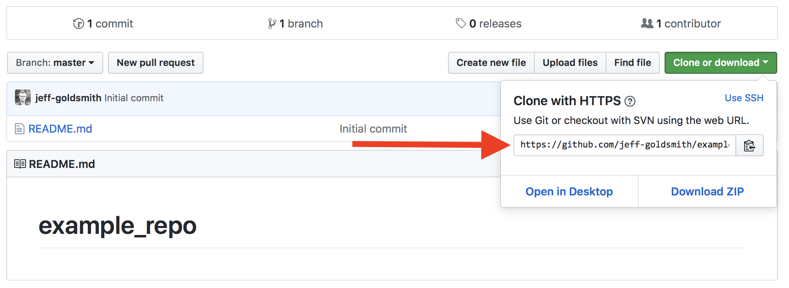
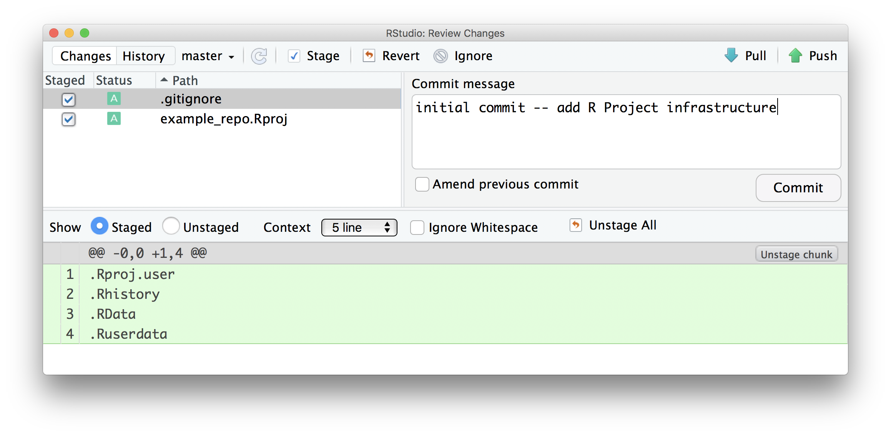
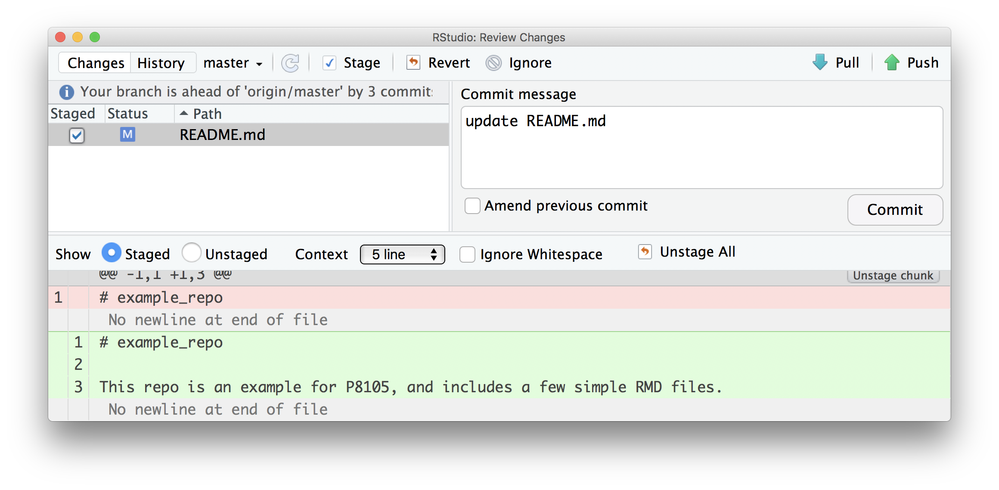
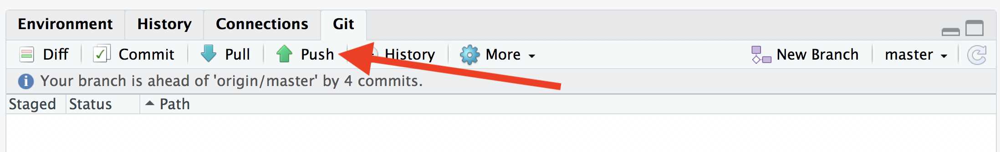
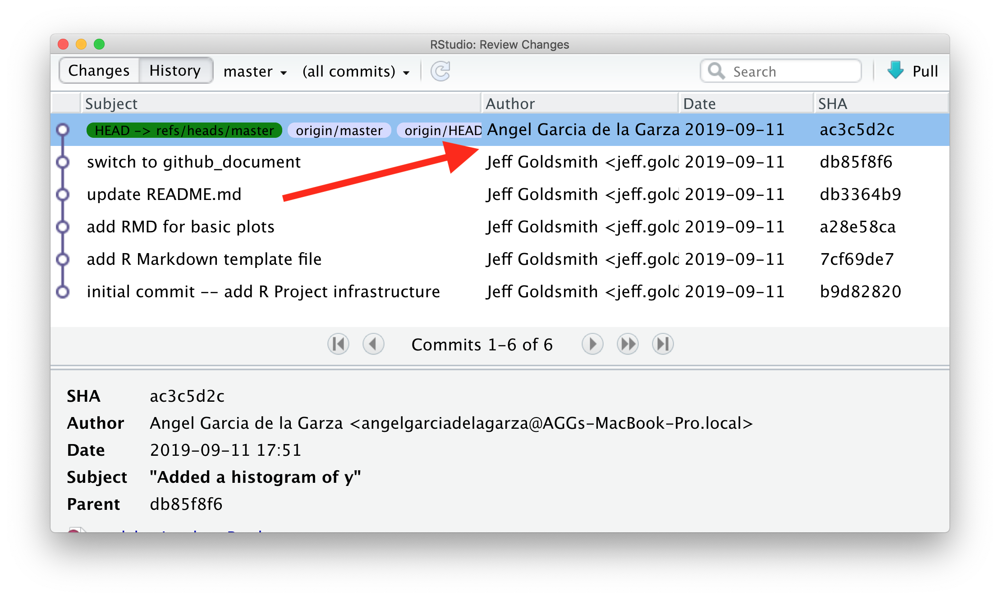
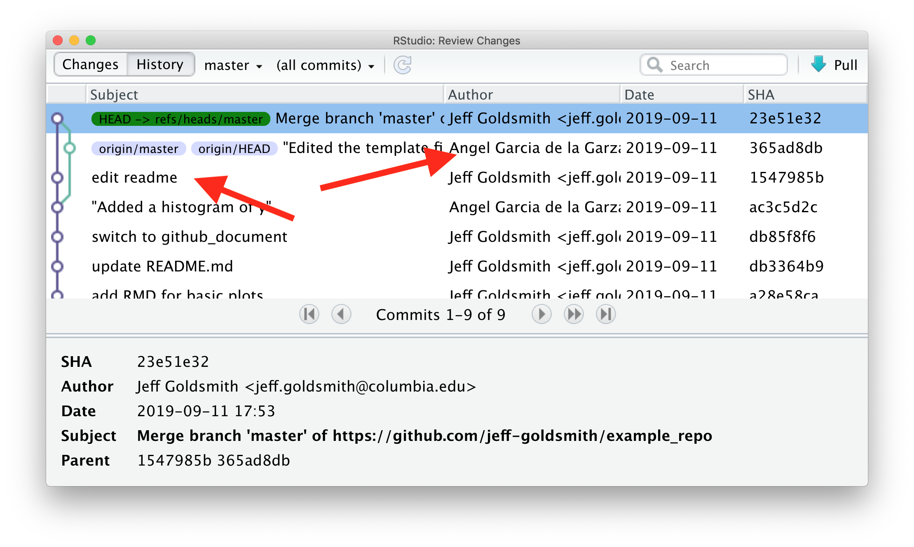
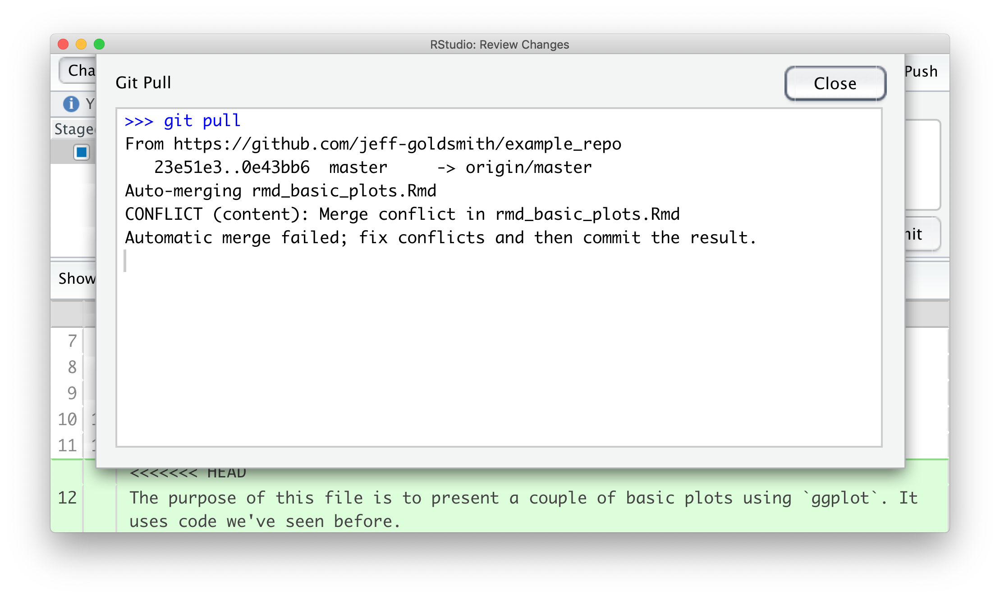

```{r, echo = FALSE}
knitr::opts_chunk$set(
  collapse = TRUE,
  fig.width = 6,
  fig.asp = .6,
  out.width = "90%"
)
```

This is the third module in the [Building blocks](topic_building_blocks.html) topic.

```{r, echo = FALSE, message=FALSE, warning=FALSE}
library(tidyverse)
```

## Overview {.tabset .tabset-pills}

### Learning Objectives

Git is awesome ... but it isn't easy at first. We'll look at how to use git and github in a data science workflow. 

### Slide Deck

<div class="vid_container">
  <iframe 
    src="https://speakerdeck.com/player/b1f65532f0644b8fb5301f8fd6934b01" 
    allowfullscreen 
    frameborder="0"
    class="video">
  </iframe>
</div>

<div style="margin-bottom:5px"> <strong> <a href="https://speakerdeck.com/jeffgoldsmith/p8105-git-and-github" title="Git and GitHub" target="_blank">Git and GitHub</a> </strong> from <strong><a href="https://speakerdeck.com/jeffgoldsmith" target="_blank">Jeff Goldsmith</a></strong>. </div><br>

***

### Video Lecture

<div class="vid_container">
  <iframe 
    src="https://www.youtube.com/embed/8jOpEnJx_A4"
    frameborder="0" allowfullscreen class="video">
  </iframe>
</div>

***

## Example

In the following, I'm assuming some important set-up steps are already done -- if you were successful in [Homework 0](homework_0.html), you should be fine. To follow along, you'll need to have git installed and a GitHub account. In some places I prefer to use a stand-alone git client (my preference is [Sourcetree](https://www.sourcetreeapp.com)), but you can get by pretty well with RStudio's built-in tools. Help for git installation and troubleshooting can be found in Chapters 4-9 of [this book](http://happygitwithr.com) by Jenny Bryan (note -- all the rest of those chapters are also great).

For this example, I'm going to re-do stuff from [Writing with Data](writing_with_data.html).


### New workflow -- GitHub first

We talked about a good workflow in [Writing with Data](writing_with_data.html), with a focus on R Projects for organization and R Markdown for reproducibility. We're adding version control using git to that workflow; git is useful by itself, and is also a popular tool to collaboration. There are a couple of ways include git in our workflow, but the one we'll start with is:

* **Create a GitHub repo with an informative name**
* Create a linked R Project using File > New Project **> Version Control**
* Keep everything related to the analysis -- data inputs, scripts, reports, output -- in the directory, and use R Markdown as much as possible
* **Keep track of changes using version control (save, commit, push)**
* Periodically check for reproducibility of the analysis

The bold steps are new. 

Walking through step-by-step, create a new GitHub repo online:


On the next page, choose your repo name, set to "Public", initialize with a README, and create the repo


Once you have your GH repo, find the link to clone:



Now, in RStudio, start a new Project using File > New Project > Version Control. 

* Provide the repository URL (copy from GitHub)
* Assign the Project a name (usually the same as the GH repo)
* Put the Project in a reasonable place on your computer

Once you've done this, a few things will happen. Most obviously, you now have a Project with the name you chose, and that project contains the .Rproj file, your README.md from GitHub, and a `.gitignore` file (by default, this will ignore `.Rproj.user`, `.Rhistory`, `.RData`, and `.Ruserdata`). Less obviously, git is now watching your directory and will keep track of changes across versions of your work, and there's a new "Git" tab in the top-right RStudio pane. 

Optionally, you can add the R Project to a separate git client. 

**_Learning Assessment:_** Follow the process above to create your own repo on GH and clone it as an R Project using RStudio.

### Commit to git

At this point, I haven't done much "work" -- I've created a repo and set up a project. Although I haven't really done much yet I'm going to make an initial commit with the Project set-up, which is a nice starting point.



Now I'll start actually doing stuff. As I noted above, I'm going to repeat some of [Writing with Data](writing_with_data.html) -- my goal is to focus on the git side of things without distractions from new code. As a first step, I'll add an R Markdown template (download [here](resources/template.Rmd)), knit it, and commit.


Next I'll add an R Markdown file looking at basic plots (shown below; download [here](resources/rmd_basic_plots.Rmd)) to my repository / directory.

```{r, echo = FALSE, comment = ""}
cat(
  htmltools::includeText("resources/rmd_basic_plots.Rmd") %>% 
    str_sub(start = 9))
```

Now I'll commit.


Next I'll update my README.md file. And commit.



How frequently you commit is, to some extent, a matter of taste. Roughly speaking, I commit after changes that are big enough to that I'd want a reminder about what they contain in six months. Also, after a while, committing becomes almost second-nature (or at least isn't something that takes a lot of time or energy) and that makes it easier to commit often.

The commit messages and git diffs are key features, and will help you understand (or remember) what changed at each stage -- commit messages should summarize main changes (and maybe give some details), and git diffs will show what files were added / edited and what the line-by-line changes were.

**_Learning Assessment:_** Make some changes to your repo (edit your README, add a file, etc) and commit those changes. 


### Push to GitHub

Git is useful as a version control system all by itself, but it is especially powerful when combined with GitHub. This combination relies on pairing your "local repository" with a "remote repository" -- local is on your computer, remote is in the cloud (i.e. on GitHub's servers). Fortunately, in the "GitHub First" workflow, the local / remote pairing is basically done for you. So, the next step is to "push to remote", a step that drives home the difference between local and remote repositories: you can make local changes and commits, but the remote repository won't know about them until you push. 



Once you've pushed, all your commits are viewable on GitHub.


**Note:** GitHub has a variety of security features. One that will be relevant right now is the use of Personal Access Tokens rather than passwords for pushing to and pulling from remote repositories. There are several [useful](https://stackoverflow.com/questions/68775869/support-for-password-authentication-was-removed-please-use-a-personal-access-to) [guides](https://usethis.r-lib.org/articles/articles/git-credentials.html) to get help with this. Once you've set up your PAT and try to push, RStudio may prompt you for your GitHub username and password; provide your new PAT, and you're be all set. Fortunately, you should only have to do this once, and the credentials will be stored for later uses. 

GitHub has a lot of features that help as projects grow: issue trackers function as collaborative "to-do" lists, the built-in message system helps coordinate with collaborators, and others. You can also see what other people are working on, follow repos or developers, create your own versions of existing repos, and do other exciting stuff!

**_Learning Assessment:_** Make sure you can push your commits to remote!


### .md Files on GitHub

Markdown files (not *R* Markdown, just .md files) are rendered in an HTML-like way on GitHub. We already took advantage of this, in fact, in the README.md file -- this has particular prominence on a repo's GH page, but other .md files are rendered similarly. 

Our use of R Markdown to write reproducible reports makes the treatment of .md files on GH especially nice. Recall that we used `knitr::knit` to render a .Rmd file to a .md file, which in turn was rendered to another format (.html, .pdf, .docx). By using the `github_document` output format, we can instead produce .md files (there are, of course, other ways to achieve the same end). This is great, because the report -- including text, code results, and figures -- can be produced in a way that is easily viewable on GitHub!

**_Learning Assessment:_** Change one (or both) of your .Rmd files to output `github_document`s. Re-knit, commit, and push -- and then view the results on GitHub. 


### Collaborating via GitHub

Sharing repositories via GitHub makes it possible to collaborate in a clear, rigorous way. As each person makes changes:

* written commit messages let others know what has changed and why
* line-by-line comparisons (additions and deletions) show exactly what was changed.

This is great if you're working in a team, or if you are considering future-you as a collaborator.

For the repository holding this example, I'll add Angel as a collaborator. Once he's been added, he's going to add a histogram of `y` to our basic plot RMD. He'll commit and push; I'll relax until he's done, then pull his changes from the remote repository to my local repository. Those changes will appear in my local repository, and a summary of the changes are in my git history. 



Of course, team members may want to work in parallel. As an example, I'll edit the README a bit and Angel will edit the template RMD file. Once I've written my code, I'm going to commit; pull to see if there are any changes in the remote repository; and then push everything.



This process (commit > pull > push) can help keep you out of trouble, although other approaches are possible.


### Conflicts

When we're working in parallel on non-overlapping elements, everything is pretty smooth. I can edit and commit, and so can Angel; as we cycle through the commit > pull > push cycle, git knows we're not editing the same stuff and keeps track of the changes. 

We can run into issues when we both edit the same thing -- suppose, for example, we both try to update the line describing the purpose of `basic_plots.Rmd`. If he commits and pushes before I do, when I commit and pull I'll see the following:



We've both written text in the same place, and have to make a decision about which to keep. You have a couple of options: one is to open the file in question, go through each conflict (which will be indicated in text), fix the text to your liking and remove all the markers that indicate the conflicts. We can also do this with the help of a merge tool, which will show where differences are and allow us to make a choice about which to keep. 


After resolving conflicts, I should commit the changes and push the new unified version to the remote repository.

Merge conflicts are a fact of life in collaborative work, and you probably run into them more often than you'd like to admit (e.g. "Jeff's Conflicted Copy" in Dropbox, or parallel versions of Word documents). Git can seem like it makes this worse, but that's mostly because it's new and scary, and it forces you to address conflicts as they arise in a structured way rather than ignoring issues / managing them in an ad-hoc way. 

That said, try to coordinate with teammates so it's clear who is working on what and when they're doing it. 


### New workflow -- Project first

The "GitHub first" workflow works well, but it's not the only way to add version control to an R Project. An alternative is "Project first":

* Create an R Project with a reasonable name and path (via `usethis::create_project()`)
* **Turn on version control for the project using git** (via `usethis::use_git()`)
* **Optionally, create remote repository** (via `usethis::use_github()`)
* Keep everything related to the analysis -- data inputs, scripts, reports, output -- in the directory, and use R Markdown as much as possible
* **Keep track of changes using version control (save, commit, push)**
* Periodically check for reproducibility of the analysis

Bold steps are new with respect to the workflow in [Writing with Data](writing_with_data.html). This workflow is useful if you don't intend for your repo to end up "in the cloud", whic his sometimes the case, but means you have to take steps to create the remote repository.


## Other materials

There's a lot of stuff to help with git in general, and with git for R in particular. This is a non-exhaustive list:

* Jenny Bryan's [article](https://peerj.com/preprints/3159/) "Excuse me, do you have a moment to talk about version control?" is excellent
* Jenny Bryan's [book](http://happygitwithr.com) (same as the link above) is really helpful, and has chapters on several workflows
* The [GitHub](https://guides.github.com/activities/hello-world/) guide
* Version control with [RStudio](https://support.rstudio.com/hc/en-us/articles/200532077-Version-Control-with-Git-and-SVN)

The GitHub repository I created working through this example is [here](https://github.com/jeff-goldsmith/p8105_example/).
