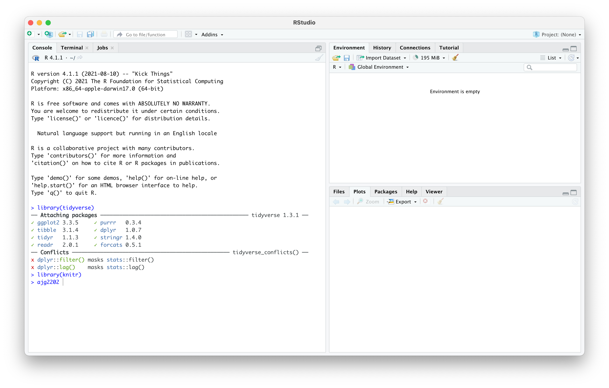
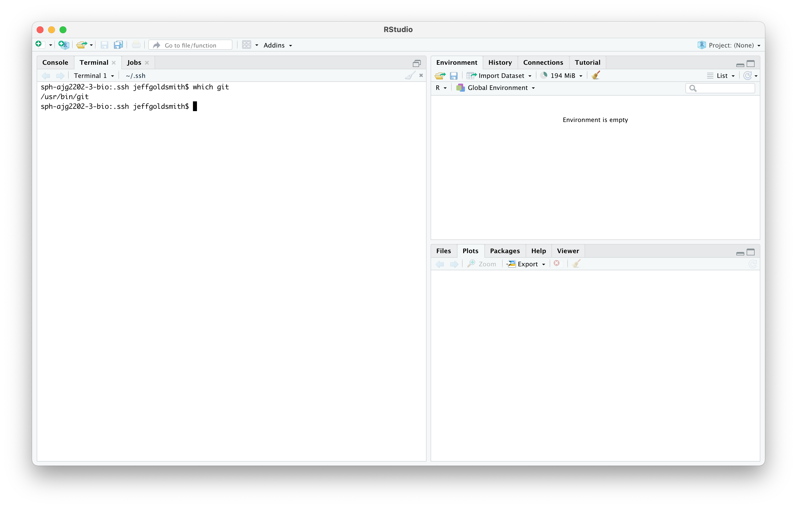

### Context

R and RStudio are required for this course, as are several R packages. Additionally, we will make extensive use of Git and Github. The goal of this homework assignment is to ensure that you have installed relevant software and packages. 

### Due date

Due: September 11 at 10:00pm. 

### Problem 1

Download and install the latest versions of [R](https://cran.r-project.org) (4.0.2) and [RStudio](https://www.rstudio.com/products/rstudio/download/) (1.3.1073). 

Open RStudio and install several packages (and their dependencies) using the code below:

```{r eval = FALSE}
install.packages(
  c("tidyverse", "knitr", "rmarkdown", "janitor", "broom", "here", "readxl", 
    "haven", "rnoaa", "ggridges", "ggthemes", "leaflet", "viridis", "skimr", 
    "rvest", "httr", "flexdashboard", "devtools", "usethis", "modelr", "mgcv", 
    "tidytext", "shiny", "patchwork", "glmnet"))

devtools::install_github("p8105/p8105.datasets")
```

(Note: on a Mac running OSX, you may need to install the [command line tools](http://osxdaily.com/2014/02/12/install-command-line-tools-mac-os-x/) for these pacakges to install.)

Upload a screenshot of RStudio that shows your R version, and that you can successfully load the packages `tidyverse` and `knitr`; include your UNI on the command line. Here's an example "solution":



### Problem 2

Install Git on the machine you'll use for work in this course. There are several installation approaches; I suggest you follow [this guide](http://happygitwithr.com/install-git.html).

Upload a screenshot of RStudio's terminal pane that shows a successful execution of:

* `which git` or `git --version` (for OSX / Mac) 
* `where git` (for Windows / PC). 

Here's an example "solution":



### Problem 3

Create a user account on GitHub, and submit your user name using [this google form](https://docs.google.com/forms/d/e/1FAIpQLSeWWe8mTTZqlr4cOmb_jRelfFqDKWYdyxjvE3fWETz6-Y510g/viewform).

It is **very strongly recommended** that you register your account with an educational / academic discount -- later in the semester we will require private repos, which are free under this plan. 

