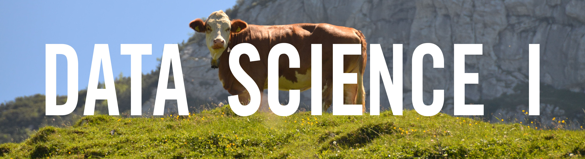

   

Contemporary biostatistics and data analysis depends on the mastery of tools for computation, exploratory analysis, visualization, dissemination, and reproducibility, in addition to proficiency in traditional statistical techniques. The goal of this course is to provide training in the elements of a complete pipeline for data analysis. We will develop skills in data wrangling, reproducible research, software development, collaboration, and effective communication; all programming will be done in R. Although there are no formal prerequisites for this course, some familiarity with statistics and basic programming knowledge will be helpful.

This course is being offered in the Fall of 2021 through the Biostatistics Department at the Columbia School of Public Health; the syllabus is available here [[pdf](resources/P8105_Syllabus.pdf) | [docx](resources/P8105_Syllabus.docx)].

### People

* Jeff Goldsmith (Instructor; ajg2202)
* Margaret Gacheru (Lead TA; mg3861)
* Tessa Senders (Lead TA; ts3349)
* Caroline Andy
* Nikhita Damaraju
* Rachel Heise
* Chong Li
* Zhuohui Liang
* Phoebe Mo
* Yan Rio
* Lihn Tran

<!--
### Calendar

<iframe src="https://calendar.google.com/calendar/embed?showTitle=0&amp;showDate=0&amp;showPrint=0&amp;showCalendars=0&amp;mode=WEEK&amp;height=400&amp;wkst=1&amp;bgcolor=%23ffffff&amp;src=bst.p8105%40gmail.com&amp;color=%231B887A&amp;ctz=America%2FNew_York" style="border-width:0" width="800" height="400" frameborder="0" scrolling="no" align="middle"></iframe>

-->
