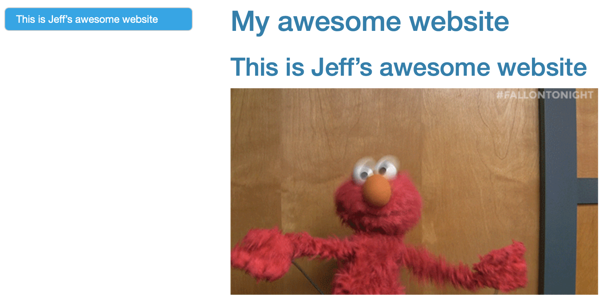
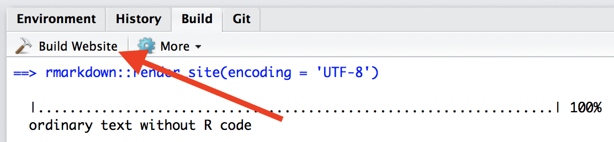
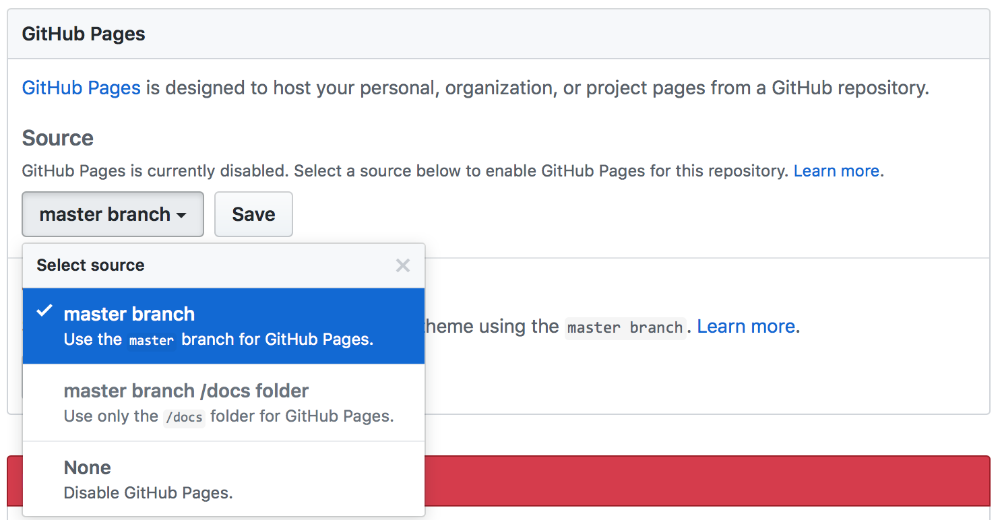

This page outlines the process of making a basic website using R Markdown, and hosting that website on GitHub -- the content assumes familiarity with both .Rmd and GitHub. 

This is the first module in the [Interactivity](topic_interactivity.html) topic.

## Overview {.tabset .tabset-pills}

### Learning Objectives

Publish a personal website using GitHub pages.

### Slide Deck

<div class="vid_container">
  <iframe 
    src="https://speakerdeck.com/player/e4897332b1e345e8a223b5e82fc61504" 
    allowfullscreen 
    frameborder="0"
    class="video">
  </iframe>
</div>

<div style="margin-bottom:5px"> <strong> <a href="https://speakerdeck.com/jeffgoldsmith/p8105-making-websites" title="Making Websites" target="_blank">Making Websites</a> </strong> from <strong><a href="https://speakerdeck.com/jeffgoldsmith" target="_blank">Jeff Goldsmith</a></strong>. </div><br>

***

### Video Lecture

<div class="vid_container">
  <iframe 
    src="https://www.youtube.com/embed/guTdeLfgLZU"
    frameborder="0" allowfullscreen class="video">
  </iframe>
</div>

***

## Example

The example below is built around the construction of a "personal" website, but the steps are the same for any other website you want to create.

### Create a repo

This is going to hold everything you want on your website, and the name does matter:

* Call it `<YOUR_GH_NAME>.github.io` if you want this to be your personal website
* Call it whatever you want if it will be something different (tip: website names should be short and easy-to-remember; they're also generally case-sensitive)
* Create a local R Project / directory for this repo


### Getting started

All websites have an `index.html` file -- it's the most common name for the default page and gets served up whenever someone shows up at your site. We'll start by using this [`index.Rmd`](resources/index.Rmd) file. This has usual RMD stuff: a title, some headings, some content. Anything you could put in any other RMD file, you can put in here, too. Then, as usual, you can knit to create `index.html`; you should get something like the following. 



**NOTE:** Web page names are case sensitive, and `index.html` has to start with a lower-case "i". 

### Common content

Your website can include text, of course; you can also include code and figures generated from analyses. Like I keep saying, you're writing in RMD.

One important feature of your site will be hyperlinks. The general format for links is `[text for link](address.of.link)`. So, to link to my favorite tool for data science, I'd use `[this](google.com)`.

Your website usually has more than one page. These pages can be created using the same process as `index.html`: create an Rmd file and knit to html. Once you have another page (e.g. `about.html`) you need to link to it from your home page (e.g. using use `[about](about.html)`), or no one will be able to find it. 

Sometimes you want to add images -- pictures you've taken or found on the internets, rather than things that are generated from analyses. This is a bit more involved than other things you might want to do. RMD's default image settings (using ``) aren't great. I often use a line of HTML:

```{r, eval = FALSE}

```

This will load and display `images/image.jpg` (I usually keep my images inside an `images` folder to reduce clutter). The `style` components control things like adding a border or adjusting the image height or width, along with lots of other things -- googling around can help if you want to change the style settings. If you want your style rules to apply to all images it can be easier to write a short CSS file, but that's beyond what we're going to do now.


### `_site.yml`

Right now, all our pages have styling, output, and structure coming from page-specific YAML. It's better to have one set of rules that apply site-wide instead. To do this, we'll create a single file with all the YAML stuff we need, and at the same time remove extraneous YAML header content from individual Rmd files.

Create your `_site.yml` file by going to File > New File > Text file. Copy the content below, and save the file as `_site.yml` in your project's home folder. 

```{r yml, eval = FALSE}
name: "Yay internet!"
output_dir: "."
navbar:
  title: "Home"
  right:
    - text: "About"
      href: about.html
    - icon: fa-envelope fa-lg
      href: mailto:<you@youremail.com>
    - icon: fa-github fa-lg
      href: http://github.com/<YOUR_GH_NAME>/
output:
  html_document:
    theme: cerulean
```

This contains some usual kinds of formatting stuff, like `output` options, but also the `navbar`. After saving this (and removing YAML from each page), re-knit `index.Rmd` and `about.Rmd` -- there's a navigation bar across the top that has nothing to do with `index.Rmd`. 

There are several ways you can arrange the nav bar (right vs. left; single pages vs. drop-down menus) but the idea is to give a way to navigate through your _site_, not just your _page_. The two icons are there to encourage good practices -- an easy way for someone to email you, and a link to the source for the site on GitHub (icons come from [font awesome](http://fontawesome.io/icons/)). I've also included an "About" page, which is pretty common for pages describing projects.


### Template website

We've been creating a website from scratch, but it's sometimes helpful to have a quick-start template with a couple of pages and a `_site.yml` file. We've put together such a [website template](resources/website_template.zip) for that reason.


### R Project

One nice feature is that RStudio will recognize your project as a website, and give you a quick way to build the complete website using the "build website" button. This is really just a shortcut to `rmarkdown::render_site()`, but it's still nice. 



This rebuilds the full website, whereas the `knit` button only rebuilds a page. Rebuilding the site can be useful if you've made big changes, like changing the `_site.yml`. 


### Hosting on GitHub

Once you've built your site, your directory should include `index.html` and `about.html` (in addition to the respective RMD files), `_site.yml`, the .Rproj, and a folder with some stuff you don't need to worry about. That's great -- you have a website! Except it exists only on your computer, so ... not really a _web_ site...

This is where GitHub helps. GitHub will recognize your repository as a website and host it as such. If your repo is named `<YOUR_GH_NAME>.github.io`, that's your personal site address. If your repo has another name, your site address will be `<YOUR_GH_NAME>.github.io/<YOUR_PROJECT_NAME>`. Often this "just works", but sometimes you have to update the repo settings for GitHub to know this is a website, especially for websites that are not `<YOUR_GH_NAME>.github.io`:

* Make sure you've pushed what you have to GitHub
* Log in to GitHub, find the repo, and navigate to repo settings
* Set the GitHub pages source to the master branch (see below)



That's it!

Moving forward, make edits to your website by editing your .Rmd files or `_site.yml` and then rebuilding your site in RStudio (which will update the .html files). Then push these changes from your local directory to GitHub so they are reflected online. 


### Tips for building websites

The important stuff on your website is the content -- what you say, how clearly you say it, and how easy it is for a reader to find the information they care about. Keeping things up-to-date is critical, and can require frequent tweaking (of e.g. your resume or list of projects). 

Default website themes are pretty good. You can modify these if you want; speaking from experience, you can also fall down a rabbit hole and spend a few days learning CSS to make stylistic changes that seem critical but that, in fact, no one will ever notice. That's probably not a good use of your time, and you will eventually get tired of any styling you do anyway. Instead, add a [default theme](https://bootswatch.com/3/) to your YAML and change it from time to time. (RStudio is a bit behind in their bootstrap themes; if you find another one you want to add, you might find [this thread](https://community.rstudio.com/t/in-rstudio-rmarkdown-how-to-add-new-html-themes-from-bootswatch/15791/2) useful. 

The best way to extend your website is to copy from other websites you like. You can borrow structurally (e.g. how content is organized) or specific elements (e.g. how that person added a twitter button). People generally understand that this happens (and make their code public to help!), but if you borrow a lot it's friendly to shoot the person an email to say their stuff was useful.


### Websites about projects

As noted, the preceding example is about a personal website but illustrates useful ideas. If you're making a website about a data science project, I recommend including:

* A landing page giving a broad overview of the project
* A page (or pages) about the data wrangling, including the raw data if appropriate
* Separate pages for each distinct analysis, possibly organized using menus
* R and package versions used in the analyses


## Other materials

There's a lot of material online to help with making websites. You should use it. 

* RStudio's [guide](http://rmarkdown.rstudio.com/rmarkdown_websites.html)
* This [walk through](http://nickstrayer.me/RMarkdown_Sites_tutorial/)
* GitHub [Pages](https://pages.github.com)

The website I produced during lecture is [here](http://bst-p8105.github.io), and the materials can be downloaded from this [GitHub repo](https://github.com/bst-p8105/bst-p8105.github.io/). 

