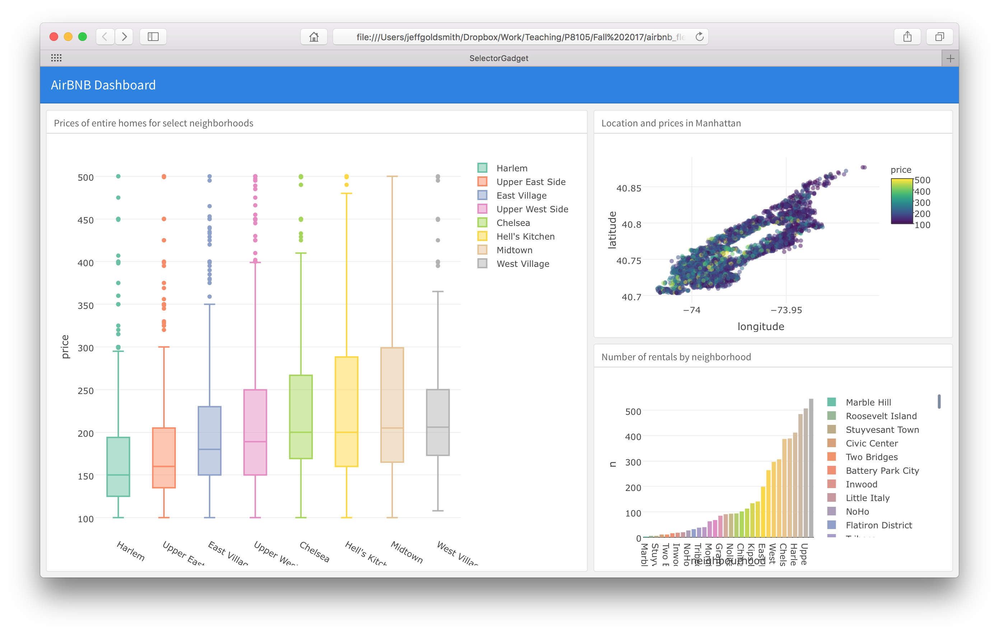

Plotly is a flexible framework for producing interactive graphics; it has a variety of implementations, including one for R. We'll take a look at a few common plot types, and then introduce `flexdashboards` as a way to collect plots (either static or interactive).

This is the second module in the [Interactivity](topic_interactivity.html) topic.

```{r, include = FALSE,message=FALSE,warning=FALSE}
library(tidyverse)

knitr::opts_chunk$set(
	echo = TRUE,
	warning = FALSE,
  fig.width = 6,
  fig.asp = .6,
  out.width = "90%"
)

theme_set(theme_minimal() + theme(legend.position = "bottom"))

options(
  ggplot2.continuous.colour = "viridis",
  ggplot2.continuous.fill = "viridis"
)

scale_colour_discrete = scale_colour_viridis_d
scale_fill_discrete = scale_fill_viridis_d
```

## Overview {.tabset .tabset-pills}

### Learning Objectives

Create interactive graphics using plot.ly and design a data dashboard using `flexdashboard`.

### Slide Deck

<div class="vid_container">
  <iframe 
    src="https://speakerdeck.com/player/674218dc49484b6898ee32eb47ba646d" 
    allowfullscreen 
    frameborder="0"
    class="video">
  </iframe>
</div>

<div style="margin-bottom:5px"> <strong> <a href="https://speakerdeck.com/jeffgoldsmith/p8105-plotly-and-dashboards" title="Plotly and Dashboards" target="_blank">Plotly and Dashboards</a> </strong> from <strong><a href="https://speakerdeck.com/jeffgoldsmith" target="_blank">Jeff Goldsmith</a></strong>. </div><br>

***

### Video Lecture

<div class="vid_container">
  <iframe 
    src="https://www.youtube.com/embed/_hgTpHDkfQs"
    frameborder="0" allowfullscreen class="video">
  </iframe>
</div>

***

## Example

For this example, I'll create a new .Rmd file that knits to .html in the repo / R Project holding the website I made in [making websites](making_websites.html). In addition to some usual packages, I'll load `plotly`.

```{r}
library(tidyverse)
library(p8105.datasets)

library(plotly)
```

We're going to focus on the [Airbnb](dataset_airbnb.html) data for this topic. The code below extracts what we need right now; specifically, we select only a few of the variables, filter to include a subset of the data, and down-sample for computational efficiency. 

```{r import_data}
data(nyc_airbnb)

nyc_airbnb = 
  nyc_airbnb %>% 
  mutate(rating = review_scores_location / 2) %>%
  select(
    neighbourhood_group, neighbourhood, rating, price, room_type, lat, long) %>%
  filter(
    !is.na(rating), 
    neighbourhood_group == "Manhattan",
    room_type == "Entire home/apt",
    price %in% 100:500)
```

We'll use this dataset as the basis for our plots. 


### Plotly scatterplot

There are several practical differences comparing `ggplot` and `plot_ly`, but the underlying conceptual framework is similar. We need to define a dataset, specify how variables map to plot elements, and pick a plot type. 

Below we're plotting the location (latitude and longitude) of the rentals in our dataset, and mapping `price` to color. We also define a new variable `text_label` and map that to text. 

The type of plot is `scatter`, which has several "modes": `markers` produces the same kind of plot as `ggplot::geom_point`, `lines` produces the same kind of plot as `ggplot::geom_line`.

```{r}
nyc_airbnb %>%
  mutate(text_label = str_c("Price: $", price, "\nRating: ", rating)) %>% 
  plot_ly(
    x = ~lat, y = ~long, type = "scatter", mode = "markers",
    color = ~price, text = ~text_label, alpha = 0.5)
```

This can be a useful way to show the data -- it gives additional information on hovering and allows you to zoom in or out, for example. 

### Plotly boxplot

Next up is the boxplot. The process for creating the boxplot is similar to above: define the dataset, specify the mappings, pick a plot type. Here the type is `box`, and there aren't modes to choose from. 

```{r}
nyc_airbnb %>% 
  mutate(neighbourhood = fct_reorder(neighbourhood, price)) %>% 
  plot_ly(y = ~price, color = ~neighbourhood, type = "box", colors = "viridis")
```

Again, this can be helpful -- we have a five-number summary when we hover, and by clicking we can select groups we want to include or exclude.

### Plotly barchart

Lastly, we'll make a bar chart. Plotly expects data in a specific format for bar charts, so we use `count` to get the number of rentals in each neighborhood (i.e. to get the bar height). Otherwise, the process should seem pretty familiar ...

```{r}
nyc_airbnb %>% 
  count(neighbourhood) %>% 
  mutate(neighbourhood = fct_reorder(neighbourhood, n)) %>% 
  plot_ly(x = ~neighbourhood, y = ~n, color = ~neighbourhood, type = "bar", colors = "viridis")
```

Interactivity in bar charts is kinda neat, but needs a bit more justification -- you can zoom, which helps in some cases, or you could build in some addition information in hover text. 

### ggplotly

You _can_ convert a `ggplot` object straight to an interactive graphic using `ggplotly`.

For example, the code below recreates our scatterplot using `ggplot` followed by `ggplotly`. 

```{r}
scatter_ggplot = 
  nyc_airbnb %>%
  ggplot(aes(x = lat, y = long, color = price)) +
  geom_point(alpha = 0.25) +
  coord_cartesian()

ggplotly(scatter_ggplot)
```

We can recreate our boxplot in a similar way.

```{r}
box_ggplot = 
  nyc_airbnb %>% 
  mutate(neighbourhood = fct_reorder(neighbourhood, price)) %>% 
  ggplot(aes(x = neighbourhood, y = price, fill = neighbourhood)) +
  geom_boxplot() +
  theme(axis.text.x = element_text(angle = 90, hjust = 1))

ggplotly(box_ggplot)
```

If I really want an interactive plot to look good, I'll use `plot_ly` to build it -- `ggplot` was designed with static plots in mind, and the formatting and behavior of `ggplotly` is less visually appealing (to me) than `plot_ly`. 

I use `ggplot` for static plots, and I make static plots way, _way_ more frequently than interactive plots. Sometimes I'll use `ggplotly` on top of that for some quick interactivity; this can be handy to do some zooming or inspect outlying features. 


### `flexdashboard`

Clearly you can embed interactive graphics in HTML files produced by R Markdown; this is a handy time to introduce dashboards. In short, dashboards are a collection of related graphics (or tables, or other outputs) that are displayed in a structured way that's easy to navigate. 

You can create dashboards using the `flexdashboard` package by specifying `flex_dashboard` as the output format in your R Markdown YAML. There are a variety of layout options, but we'll focus on a pretty simple structure produced by the template below. This is the default dashboard template in R Studio -- if you have `flexdashboard` installed, you can use `File > New File > R Markdown > From Template` to create a new .Rmd file with the structure below.

```{r, echo = FALSE, comment = ""}
cat(htmltools::includeText("resources/dashboard_template.Rmd"))
```

Conveniently, this dashboard has space for three plots! We'll populate it using the `plot_ly` plots above; doing so produces a graphic like the one shown below. 



Dashboard layouts are controlled by specifying columns and rows, and potentially subdiving these. We specified a two-column layout with set column widths, and then divided the second column into two panels. Using tabbed browsing and multiple pages can also be really useful -- check out the gallery linked below for examples!


### `flexdashboard`s on websites

You can share the HTML files for dashboards directly (e.g. by email); you can also host these online to make the dashboard visible to others. That process is essentially the same as for any other [website](making_websites.html) you'd make. 

However, the website's `_site.yml` file conflicts with the dashboard's `YAML` header regarding the output format -- and the website's `_site.yml` "wins". To address this issue, instead of knitting you can use this command to knit the dashboard.

```{r, eval = FALSE}
rmarkdown::render("dashboard_template.Rmd", output_format = "flexdashboard::flex_dashboard")
```

This will create `dashboard_template.html` but not open it in RStudio's Viewer pane; you can open the file in a browser instead. Alternatively, using RStudio's Build pane to Build Website will produce the same results. To illustrate, we'll put the dashboard we just created on a website for this topic. 

All of this `YAML` business is only an issue for dashboards embedded in websites; a standalone dashboard (in a non-website GH repo or R Project) can be knit using the same process as other .Rmd files. 


## Other materials

* Plotly can take a while to get used to; starting with their [library](https://plot.ly/r/) and [reference](https://plot.ly/r/reference/) can help. I also like the [cheatsheet](https://images.plot.ly/plotly-documentation/images/r_cheat_sheet.pdf)
* Dashboards are pretty well-supported. Check out the [overview](http://rmarkdown.rstudio.com/flexdashboard/), [layout](http://rmarkdown.rstudio.com/flexdashboard/layouts.html) discussion, and [examples](http://rmarkdown.rstudio.com/flexdashboard/examples.html)
* There are cool dashboards all over. To get a sense of how these work in the real world, check out: 
    * The NYC Restaurant Inspection [dashboard](https://data.cityofnewyork.us/Health/DOHMH-New-York-City-Restaurant-Inspection-Results/rs6k-p7g6);
    * This [app](https://juliasilge.shinyapps.io/power-app/) for understanding power (blog post [here](https://juliasilge.com/blog/ab-testing/));
    * 538's [p-hacking tool](https://projects.fivethirtyeight.com/p-hacking/index.html?initialWidth=1024&childId=phacking&parentTitle=Science%20Isn’t%20Broken%20%7C%20FiveThirtyEight&parentUrl=https%3A%2F%2Ffivethirtyeight.com%2Ffeatures%2Fscience-isnt-broken%2F) (full article [here](https://fivethirtyeight.com/features/science-isnt-broken/#part3)).

The code that I produced working examples in lecture is [here](https://github.com/bst-p8105/bst-p8105.github.io).
