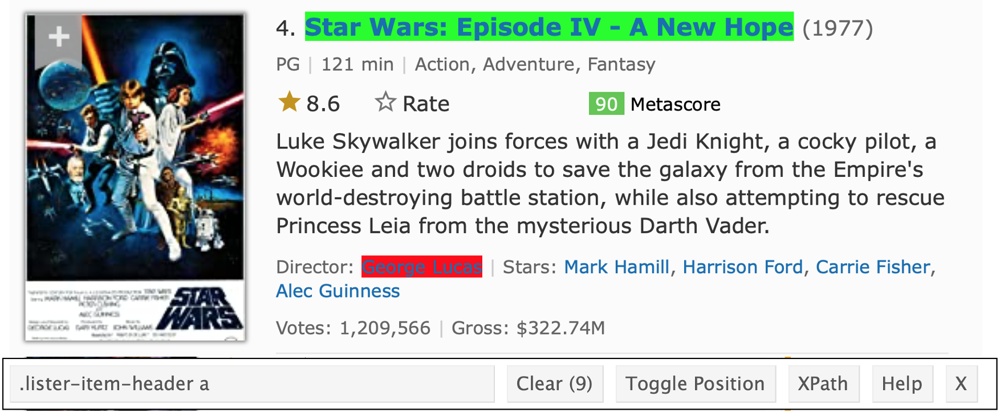

  
In [data import](data_import.html), we saw how to load data from a variety of formats; this is a fairly standard way to get data that have been gathered as part of a study. In a lot of cases, though, you're going to have to go out and get the data you want or need. That's what we're covering now.

This is the first module in the [Data Wrangling II](topic_data_wrangling_ii.html) topic.

```{r, include = FALSE, message=FALSE, warning=FALSE}
library(tidyverse)

knitr::opts_chunk$set(
	echo = TRUE,
	warning = FALSE,
  fig.width = 6,
  fig.asp = .6,
  out.width = "90%"
)

theme_set(theme_minimal() + theme(legend.position = "bottom"))

options(
  ggplot2.continuous.colour = "viridis",
  ggplot2.continuous.fill = "viridis"
)

scale_colour_discrete = scale_colour_viridis_d
scale_fill_discrete = scale_fill_viridis_d
```

## Overview {.tabset .tabset-pills}

### Learning Objectives

Gather data from online sources (i.e. “scrape”) using APIs, rvest, and httr.

### Slide Deck

<div class="vid_container">
  <iframe 
    src="https://speakerdeck.com/player/849dc71f1d784a4a9af780e5c4ba16a2" 
    allowfullscreen 
    frameborder="0"
    class="video">
  </iframe>
</div>

<div style="margin-bottom:5px"> <strong> <a href="https://speakerdeck.com/jeffgoldsmith/p8105-reading-data-from-the-web" title="Reading Data from the Web" target="_blank">Reading Data from the Web</a> </strong> from <strong><a href="https://speakerdeck.com/jeffgoldsmith" target="_blank">Jeff Goldsmith</a></strong>. </div><br>

***

### Video Lecture

<div class="vid_container">
  <iframe 
    src="https://www.youtube.com/embed/2RjK6fYWdzM"
    frameborder="0" allowfullscreen class="video">
  </iframe>
</div>

***

## Example

As always, I'll create a new GH Repo + local project called `data_wrangling_ii`, and open a new R Markdown file called `reading_data_from_the_web.Rmd`. Although we'll mostly be getting data from the web, we'll revisit some of [these examples](./resources/data_import_examples.zip), so I'll create a `data` subdirectory and put those in it.

There are some new additions to our standard packages (`rvest` and `httr`); I'm loading everything we need now. Now's also the time to "install" the [Selector Gadget](http://selectorgadget.com). 

```{r, message = FALSE}
library(tidyverse)
library(rvest)
library(httr)
```

### Extracting tables

[This page](http://samhda.s3-us-gov-west-1.amazonaws.com/s3fs-public/field-uploads/2k15StateFiles/NSDUHsaeShortTermCHG2015.htm) contains data from the National Survey on Drug Use and Health; it includes tables for drug use in the past year or month, separately for specific kinds of drug use. These data are potentially useful for analysis, and we'd like to be able to read in the first table. 

First, let's make sure we can load the data from the web. 

```{r}
url = "http://samhda.s3-us-gov-west-1.amazonaws.com/s3fs-public/field-uploads/2k15StateFiles/NSDUHsaeShortTermCHG2015.htm"
drug_use_html = read_html(url)

drug_use_html
```

Doesn't look like much, but we're there. Rather than trying to grab something using a CSS selector, let's try our luck extracting the tables from the HTML.

```{r}
drug_use_html %>%
  html_nodes(css = "table")
```

This has extracted _all_ of the tables on the original page; that's why we have a list with 15 elements. (We haven't really talked about lists yet, but for now you can think of them as a general collection of objects in R. As we proceed, syntax for extracting individual elements from a list will become clear, and we'll talk lots about lists in [list columns](listcols_and_bootstrapping.html).) 

We're only focused on the first table for now, so let's get the contents from the first list element.

```{r}
table_marj = 
  drug_use_html %>% 
  html_nodes(css = "table") %>% 
  first() %>%
  html_table() 
```

I won't print the table here, but if you look at it you'll notice a problem: the "note" at the bottom of the table appears in every column in the first row. We need to remove that; I'll also convert to a tibble so that things print nicely.

```{r}
table_marj = 
  drug_use_html %>% 
  html_nodes(css = "table") %>% 
  first() %>% 
  html_table() %>%
  slice(-1) %>% 
  as_tibble()

table_marj
```

Success!! At least, mostly. These data aren't [tidy](tidy_data.html), but we'll worry about that [soon](strings_and_factors.html). 

**_Learning assessment:_** Create a data frame that contains the cost of living table for New York from [this page](https://www.bestplaces.net/cost_of_living/city/new_york/new_york).

<details>
<summary> Solution </summary>

The code below shows one approach to this data cleaning process:

```{r, eval = FALSE}
nyc_cost = 
  read_html("https://www.bestplaces.net/cost_of_living/city/new_york/new_york") %>%
  html_nodes(css = "table") %>%
  .[[1]] %>%
  html_table(header = TRUE)
```

In case you hadn't known, NYC is kind of expensive.

</details>

### CSS Selectors

Suppose we'd like to scrape the data about the [Star Wars Movies](https://www.imdb.com/list/ls070150896/) from the IMDB page. The first step is the same as before -- we need to get the HTML.

```{r}
swm_html = 
  read_html("https://www.imdb.com/list/ls070150896/")
```

The information isn't stored in a handy table, so we're going to isolate the CSS selector for elements we care about. A bit of clicking around gets me something like below. 


  
For each element, I'll use the CSS selector in `html_nodes()` to extract the relevant HTML code, and convert it to text. Then I can combine these into a data frame. 

```{r}
title_vec = 
  swm_html %>%
  html_nodes(".lister-item-header a") %>%
  html_text()

gross_rev_vec = 
  swm_html %>%
  html_nodes(".text-small:nth-child(7) span:nth-child(5)") %>%
  html_text()

runtime_vec = 
  swm_html %>%
  html_nodes(".runtime") %>%
  html_text()

swm_df = 
  tibble(
    title = title_vec,
    rev = gross_rev_vec,
    runtime = runtime_vec)
```

Some of these movies made some real money ...


**_Learning Assessment:_** [This page](https://www.amazon.com/product-reviews/B00005JNBQ/ref=cm_cr_arp_d_viewopt_rvwer?ie=UTF8&reviewerType=avp_only_reviews&sortBy=recent&pageNumber=1) contains the 10 most recent reviews of the movie "Napoleon Dynamite". Use a process similar to the one above to extract the titles of the reviews. 

<details>
<summary> Solution </summary>

The code below will give me relevant information for the ten most recent reviews on Amazon:

```{r, eval = FALSE}
url = "https://www.amazon.com/product-reviews/B00005JNBQ/ref=cm_cr_arp_d_viewopt_rvwer?ie=UTF8&reviewerType=avp_only_reviews&sortBy=recent&pageNumber=1"

dynamite_html = read_html(url)

review_titles = 
  dynamite_html %>%
  html_nodes(".a-text-bold span") %>%
  html_text()

review_stars = 
  dynamite_html %>%
  html_nodes("#cm_cr-review_list .review-rating") %>%
  html_text()

review_text = 
  dynamite_html %>%
  html_nodes(".review-text-content span") %>%
  html_text()

reviews = tibble(
  title = review_titles,
  stars = review_stars,
  text = review_text
)
```

</details>


### Using an API

New York City has a great open data resource, and we'll use that for our API examples. Although most (all?) of these datasets can be accessed by clicking through a website, we'll access them directly using the API to improve reproducibility and make it easier to update results to reflect new data.

As a simple example, [this page](https://data.cityofnewyork.us/Environment/Water-Consumption-In-The-New-York-City/ia2d-e54m) is about a dataset for annual water consumption in NYC, along with the population in that year. First, we'll import this as a CSV and parse it.

```{r}
nyc_water = 
  GET("https://data.cityofnewyork.us/resource/ia2d-e54m.csv") %>% 
  content("parsed")
```

We can also import this dataset as a JSON file. This takes a bit more work (and this is, really, a pretty easy case), but it's still doable.

```{r}
nyc_water = 
  GET("https://data.cityofnewyork.us/resource/ia2d-e54m.json") %>% 
  content("text") %>%
  jsonlite::fromJSON() %>%
  as_tibble()
```

[Data.gov](https://catalog.data.gov/dataset?q=-aapi+api+OR++res_format%3Aapi#topic=developers_navigation) also has a lot of data available using their API; often this is available as CSV or JSON as well. For example, we might be interested in data coming from [BRFSS](https://chronicdata.cdc.gov/Behavioral-Risk-Factors/Behavioral-Risk-Factors-Selected-Metropolitan-Area/acme-vg9e). This is importable via the API as a CSV (JSON, in this example, is [more complicated](dataset_brfss.html)).

```{r, eval = FALSE}
brfss_smart2010 = 
  GET("https://chronicdata.cdc.gov/resource/acme-vg9e.csv",
      query = list("$limit" = 5000)) %>% 
  content("parsed")
```

By default, the CDC API limits data to the first 1000 rows. Here I've increased that by changing an element of the API query -- I looked around the website describing the API to find the name of the argument, and then used the appropriate syntax for `GET`. To get the full data, I could increase this so that I get all the data at once or I could try iterating over chunks of a few thousand rows.

Both of the previous examples are, actually, _pretty easy_ -- we accessed data that is essentially a data table, and we had a very straightforward API (although updating queries isn't obvious at first).

To get a sense of how this becomes complicated, let's look at the [Pokemon API](https://pokeapi.co) (which is also pretty nice).

```{r}
poke = 
  GET("http://pokeapi.co/api/v2/pokemon/1") %>%
  content()

poke$name

poke$height

poke$abilities
```

To build a Pokemon dataset for analysis, you'd need to distill the data returned from the API into a useful format; iterate across all pokemon; and combine the results. 

For both of the API examples we saw today, it wouldn't be _terrible_ to just download the CSV, document where it came from carefully, and move on. APIs are more helpful when the full dataset is complex and you only need pieces, or when the data are updated regularly. 

### Be reasonable

When you're reading data from the web, remember you're accessing resources on someone else's server -- either by reading HTML or by accessing data via an API. In some cases, those who make data public will take steps to limit bandwidth devoted to a small number of users. Amazon and IMDB, for example, probably won't notice if you scrape small amounts of data but _would_ notice if you tried to read data from thousands of pages every time you knitted a document.

Similarly, API developers can (and will) limit the number of database entries that can be accessed in a single request. In those cases you'd have to take some steps to iterate over "pages" and combine the results; as an example, our code for the [NYC Restaurant Inspections](dataset_restaurant_inspections.html) does this. In some cases, API developers protect themselves from unreasonable use by requiring users to be authenticated -- it's still possible to use `httr` in these cases, but we won't get into it.


## Other materials

* A recent short course presented similar topics to those above; a GitHub repo for the course is [here](https://github.com/ropensci/user2016-tutorial)
* A lot of [NYC data](https://opendata.cityofnewyork.us) is public; [this](https://www.opendatanetwork.com/search?q=new+york+city) is a good place to start looking for interesting data
* There are some cool projects based on scraped data; the RStudio community collected some [here](https://community.rstudio.com/t/whats-the-most-interesting-use-of-rvest-youve-seen-in-the-wild/745)
* Check out the [R file](https://github.com/tidyverse/dplyr/blob/master/data-raw/starwars.R) used to create the `starwars` dataset (in the `tidyverse`) using the [Star Wars API](https://swapi.co) (from the maker of the Pokemon API).
* Some really helpful R packages are wrappers for APIs -- the `rnoaa` package we've used is an example, and so is `rtweet`

The code that I produced working examples in lecture is [here](https://github.com/P8105/data_wrangling_ii).
