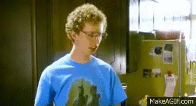

This is a bit of a diversion for a public-health-focused course in data science, but it's fun, related to web data, strings, and factors, and emphasizes tools in data wrangling. It's most closely related to content in the [Data Wrangling II](topic_data_wrangling_ii.html) topic.

```{r, include = FALSE}
library(tidyverse)

knitr::opts_chunk$set(
	echo = TRUE,
	warning = FALSE,
  fig.width = 6,
  fig.asp = .6,
  out.width = "90%"
)

theme_set(theme_minimal() + theme(legend.position = "bottom"))

options(
  ggplot2.continuous.colour = "viridis",
  ggplot2.continuous.fill = "viridis"
)

scale_colour_discrete = scale_colour_viridis_d
scale_fill_discrete = scale_fill_viridis_d
```

## Overview {.tabset .tabset-pills}

### Learning Objectives

Use `tidytext` to organize text data, and to conduct frequency and sentiment analyses.

### Slide Deck

<div class="vid_container">
  <iframe 
    src="https://speakerdeck.com/player/ee17524f046c49a58cec601fb98bb72d" 
    allowfullscreen 
    frameborder="0"
    class="video">
  </iframe>
</div>

<div style="margin-bottom:5px"> <strong> <a href="https://speakerdeck.com/jeffgoldsmith/p8105-tidy-text" title="Tidy Text" target="_blank">Tidy Text</a> </strong> from <strong><a href="https://speakerdeck.com/jeffgoldsmith" target="_blank">Jeff Goldsmith</a></strong>. </div><br>

***

### Video Lecture

<div class="vid_container">
  <iframe 
    src="https://www.youtube.com/embed/Udp2WlvuWHo"
    frameborder="0" allowfullscreen class="video">
  </iframe>
</div>

***

## Example

I'll write code for today's content in a new R Markdown document called `tidy_text.Rmd`, and put it in the extra topics directory / GitHub repo. I'm going to load the `tidyverse` as usual, as well as `tidytext` and `rvest`.

```{r}
library(tidyverse)
library(tidytext)

library(rvest)
```

### Data

We're sticking with "Napoleon Dynamite reviews"! First, I'll re-use code from [iteration and listcols](iteration_and_listcols.html) to scrape the 1000 most recent reviews on Amazon (and cache the result).

```{r read_napoleon, cache = TRUE}
read_page_reviews <- function(url) {
  
  html = read_html(url)
  
  review_titles = 
    html %>%
    html_nodes(".a-text-bold span") %>%
    html_text()
  
  review_stars = 
    html %>%
    html_nodes("#cm_cr-review_list .review-rating") %>%
    html_text() %>%
    str_extract("^\\d") %>%
    as.numeric()
  
  review_text = 
    html %>%
    html_nodes(".review-text-content span") %>%
    html_text() %>% 
    str_replace_all("\n", "") %>% 
    str_trim()
  
  tibble(
    title = review_titles,
    stars = review_stars,
    text = review_text
  )
}

url_base = "https://www.amazon.com/product-reviews/B00005JNBQ/ref=cm_cr_arp_d_viewopt_rvwer?ie=UTF8&reviewerType=avp_only_reviews&sortBy=recent&pageNumber="

dynamite_reviews = 
  tibble(
    page = 1:100,
    urls = str_c(url_base, page)) %>% 
  mutate(reviews = map(urls, read_page_reviews)) %>% 
  unnest(reviews) %>%
  mutate(review_num = row_number()) %>% 
  relocate(page, review_num)
```

The output of the code above is a successfully scraped dataset with `r ncol(dynamite_reviews)` and `r nrow(dynamite_reviews)` rows -- one row for each review. For each review we get the title of that review, the number of stars it received, and text that describers the users feelings about the movie.


### Words and wordcounts

To illustrate tidy text and text analysis, we'll focus on the reviews directly, which are stored as strings in `text`. To begin our analysis, we'll un-nest the tokens (i.e. words) in each row; the result is a tidy dataset in which each word is contained within a separate row. 

```{r}
dynamite_words = 
  dynamite_reviews %>% 
  unnest_tokens(word, text)
```

There are lots of words here that are uninformative. We'll remove "stop words" using `anti_join`; in other settings the words you want to remove might be different.

```{r}
data(stop_words)

dynamite_words = 
  anti_join(dynamite_words, stop_words)
```

Great! Let's take a look at the most commonly used (informative) words in this dataset.

```{r}
dynamite_words %>% 
  count(word, sort = TRUE) %>% 
  top_n(10) %>% 
  mutate(word = fct_reorder(word, n)) %>% 
  ggplot(aes(x = word, y = n)) + 
  geom_bar(stat = "identity", fill = "blue", alpha = .6) + 
  coord_flip()
```

### Comparing words across groups

The next code chunk below produces a table of the most frequently used in one- and five-star reviews.

```{r frequent_words}
dynamite_words %>%
  filter(stars %in% c(1, 5)) %>%
  group_by(stars) %>%
  count(word) %>% 
  top_n(5) %>%
  knitr::kable()
```

The table above gives the top 5 most frequently used words in 1-star and 5-star reviews. *Movie* is the most used word for both 1 and 5-star reviews, though other words, like  *dumb* differentiate 1-star reviews from 5-star reviews, which have words like *love*.

Word frequency might be misleading because there are 
`r dynamite_reviews %>% filter(stars == 5) %>% count()` 5-star reviews and only 
`r dynamite_reviews %>% filter(stars == 1) %>% count()` 1-star reviews.  

Let’s compare which words are more likely to come from a 1 versus 5 star ratings. We limit to words that appear at least 5 times and compute the approximate log odds ratio for each word.

```{r}
word_ratios = 
  dynamite_words %>%
  filter(stars %in% c(1, 5)) %>% 
  count(word, stars) %>%
  group_by(word) %>% 
  filter(sum(n) >= 5) %>%
  ungroup() %>%
  pivot_wider(
    names_from = stars, 
    values_from = n,
    names_prefix = "stars_",
    values_fill = 0) %>%
  mutate(
    stars_1_odds = (stars_1 + 1) / (sum(stars_1) + 1),
    stars_5_odds = (stars_5 + 1) / (sum(stars_5) + 1),
    log_OR = log(stars_5_odds / stars_1_odds)
  ) %>%
  arrange(desc(log_OR)) 
```

Next, let's plot the top 10 most distinctive words (that is, words that appear much more frequently in one group than the other) below. 

```{r, fig.asp = .8}
word_ratios %>% 
  mutate(pos_log_OR = ifelse(log_OR > 0, "5 star > 1 star", "1 star > 5 star")) %>%
  group_by(pos_log_OR) %>%
  top_n(10, abs(log_OR)) %>%
  ungroup() %>%
  mutate(word = fct_reorder(word, log_OR)) %>%
  ggplot(aes(word, log_OR, fill = pos_log_OR)) +
  geom_col() +
  coord_flip() +
  ylab("log odds ratio (5/1)") +
  scale_fill_discrete(name = "")
```

Words like "classic", "awesome", and "love" have high relative frequency in the 5-star reviews and "boring", "dumb", and "bad" have high relative frequency in the 1-star reviews. This seems to be a polarizing film.

### Sentiment analysis

Finally, let's score the sentiment in each word. We'll use the "bing" (like [Bing Liu](https://www.cs.uic.edu/~liub/FBS/sentiment-analysis.html), not like [bing.com](https://www.bing.com)) sentiment lexicon, which simply categorizes each word as having a positive or negative sentiment. 

```{r}
bing_sentiments = get_sentiments("bing")
```

Note this is might not always be appropriate -- this scores `cold` as `negative` which might not be accurate for e.g. food inspections -- but we'll use it anyway. 

We need to combine this lexicon with our tidy dataset containing words from each inspection. Note that only words that are in the sentiment lexicon will be retained, as the rest of the words are not considered meaningful. We’ll also count the number of positive and negative words in each review, and create a score that is the difference between the number of positive words and negative words.

```{r}
dynamite_sentiments = 
  dynamite_words %>% 
  inner_join(., bing_sentiments) %>% 
  count(review_num, sentiment) %>% 
  pivot_wider(
    names_from = sentiment, 
    values_from = n, 
    values_fill = 0) %>% 
  mutate(review_sentiment = positive - negative) %>% 
  select(review_num, review_sentiment)
```

We now have sentiment scores for each inspection. We'll combine these with our original dataset, which had inspections in each row rather than words in each row -- the data tidied for text analysis aren't really suitable for our current needs.

```{r}
dynamite_sentiments = 
  right_join(
    dynamite_reviews, dynamite_sentiments, 
    by = "review_num")
```

Finally, let's make a plot showing inspection sentiments and stars.

```{r sentiment_plot}
dynamite_sentiments %>% 
  mutate(
    review_num = factor(review_num),
    review_num = fct_reorder(review_num, review_sentiment, .desc = TRUE)) %>% 
  ggplot(aes(x = review_num, y = review_sentiment, fill = stars, color = stars)) + 
  geom_bar(stat = "identity") + 
  theme(
    axis.title.x=element_blank(),
    axis.text.x=element_blank(),
    axis.ticks.x=element_blank())
```

Sentiment seems to be at least somewhat associated with star rating in that more positive sentiments are more yellow-green (4-5 stars) and more negative sentiments are more blue-purple.

Here is the text from the most positive review:

```{r best_review}
dynamite_sentiments %>%
  filter(review_sentiment == max(review_sentiment)) %>% 
  pull(text)
```


And here is the text from the most negative (1-star) review:

```{r worst_review}
dynamite_sentiments %>%
  filter(review_sentiment == min(review_sentiment), stars == 1) %>% 
  pull(text)
```




## Other materials

* The framework we used is explained in detail in the [Tidy Text book](http://tidytextmining.com)
* One of the book's authors, Julia Silge, has a [nice video](https://www.youtube.com/watch?v=0poJP8WQxew) talking about the work
* The other of the book's authors, Dave Robinson, used the approach to examine Donald Trump's tweets in this this [blog post](http://varianceexplained.org/r/trump-tweets/)

The code that I produced working examples in lecture is [here](https://github.com/p8105/tidytext).
